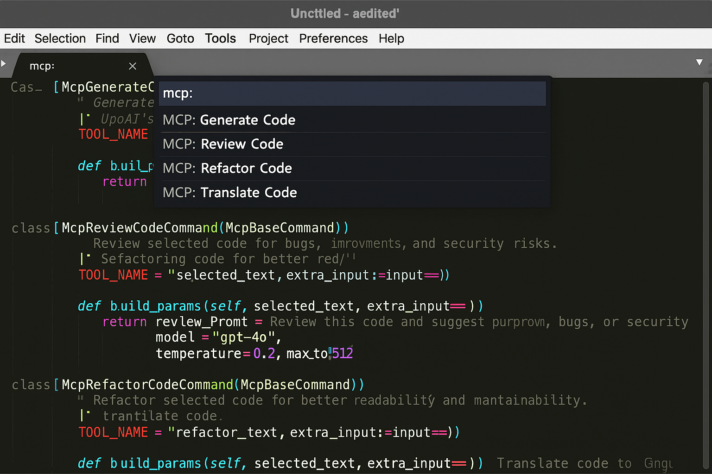

# MCPHelper – Sublime Text Plugin

This is a Sublime Text plugin that connects your editor to a local **Model Context Protocol (MCP) server**, letting you use OpenAI or Gemini-powered tools directly on selected code.

🔗 [Model Context Protocol Introduction](https://modelcontextprotocol.io/introduction)

---

## ✨ Features

- **Generate code** from plain-text prompts
- **Review code** for bugs, security flaws, or improvements
- **Refactor code** to enhance readability, maintainability, and performance
- **Translate code** between languages like Python, JavaScript, Bash, etc.
- **Configurable settings** for MCP server URL, timeouts, and model parameters
- **Menu integration** for easy access to all commands
- **Robust error handling** with user-friendly error messages
- **Debug mode** for troubleshooting

## 🖼️ Demo

Here's what the plugin looks like in Sublime Text:



---

## 🚀 Installation

### Quick Start

1. **Download the plugin files** from this repository
2. **Copy to your Sublime Text User packages folder:**

   - **Windows:** `%APPDATA%\Sublime Text\Packages\User\`
   - **macOS:** `~/Library/Application Support/Sublime Text/Packages/User/`
   - **Linux:** `~/.config/sublime-text/Packages/User/`
3. **Restart Sublime Text**
4. **Configure your MCP server** (see Configuration section below)

### Detailed Installation

For complete installation instructions, see [INSTALLATION.md](INSTALLATION.md).

---

## ⚙️ Configuration

### 1. MCP Server Setup

Ensure your local MCP server is running and accessible at the configured URL (default: `http://localhost:8000/mcp.json/`)

### 2. Plugin Settings

Open Sublime Text settings:

- Go to `Preferences > Package Settings > MCPHelper > Settings`
- Or edit the settings file directly

**Default settings:**

```json
{
  "mcp_server_url": "http://localhost:8000/mcp.json/",
  "timeout_seconds": 120,
  "show_debug_output": false,
  "default_model": "gpt-4o",
  "default_temperature": 0.2,
  "default_max_tokens": 512
}
```

### 3. MCP Server Tools

Your MCP server should have tools configured like:

```python
@mcp.tool(name="llm_generate_code_openai", description="Generate code using OpenAI")
async def generate_code_openai(params: dict) -> dict:
    # Your OpenAI integration here
    return {"results": [{"data": "generated_code"}]}
```

---

## 📖 Usage

### Command Palette

1. Select code in any file
2. Press `Ctrl+Shift+P`
3. Choose one of:

   - `MCP: Generate Code`
   - `MCP: Review Code`
   - `MCP: Refactor Code`
   - `MCP: Translate Code`

### Menu

1. Select code in any file
2. Go to `MCP Helper` menu
3. Choose your desired action

### Keyboard Shortcuts (Optional)

Add to your keybindings file (`Preferences > Key Bindings`):

```json
[
  {
    "keys": ["ctrl+shift+g"],
    "command": "mcp_generate_code"
  },
  {
    "keys": ["ctrl+shift+r"],
    "command": "mcp_review_code"
  },
  {
    "keys": ["ctrl+shift+f"],
    "command": "mcp_refactor_code"
  },
  {
    "keys": ["ctrl+shift+t"],
    "command": "mcp_translate_code"
  }
]
```

---

## 🔧 Troubleshooting

### Common Issues

1. **"Cannot connect to MCP server"**

   - Ensure your MCP server is running
   - Check the URL in settings
   - Verify the server is accessible at the configured endpoint

2. **"MCP Tool Error"**

   - Check your MCP server logs
   - Verify the tool names match your server configuration
   - Ensure API keys are properly configured in your MCP server

3. **"No text selected"**

   - Select some code before running commands
   - Commands require text selection to work

### Debug Mode

Enable debug output in settings:

```json
{
  "show_debug_output": true
}
```

This will show detailed request/response information in the Sublime Text console.

### Console Access

View debug output:

1. Go to `View > Show Console`
2. Look for messages starting with "MCP"

---

## 🧩 Extending

You can add new commands by subclassing `McpBaseCommand` and customizing `build_params()`:

```python
class McpCustomCommand(McpBaseCommand):
    TOOL_NAME = "your_custom_tool"
    
    def build_params(self, selected_text, extra_input=None):
        return {
            "prompt": f"Custom prompt: {selected_text}",
            "language": "python"
        }
```

---

## 📄 License

This project is licensed under the MIT License. See [LICENSE](LICENSE) for details.

---

## 👤 Author

David Donohue

Built to streamline LLM-assisted development with a local-first mindset.

> ⚠️ **Important:** This plugin requires a running [MCP Server](https://modelcontextprotocol.io) on your local machine. You must configure your own OpenAI or Gemini API keys in the MCP server. This plugin does not directly handle authentication or make API calls — it simply communicates with your local MCP server to trigger the tools you've defined.
